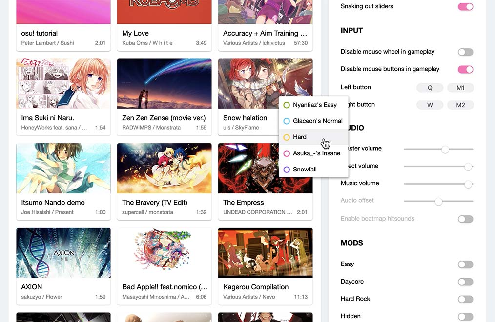
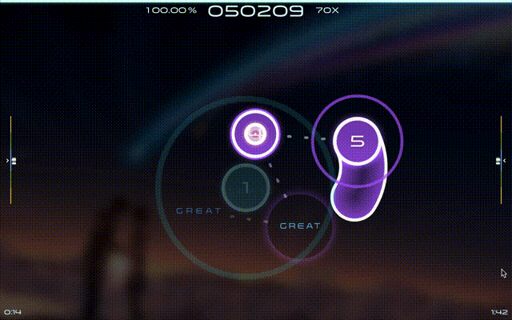

# osu! web

osu! that can be played in a browser

currently **unplayable** (music not syncing)

(under development)

In case you haven't heard of osu!, it's a game where players click circles on the screen, following rhythm of the music.

It runs on Firefox & Chrome. It doesn't run on Safari currently.

Note: This is an unofficial implementation of [osu!](https://osu.ppy.sh). It has nothing to do with @ppy. Scoring and judgement rules can differ from that of official osu!.

Modes other than osu! (std) are unsupported.

## Screenshots

web page:



game in action:



## Hosting

Just set up a local web server with root directory located where `index.html` is in.

## Current functions

- audio offset: no
- input offset: no
- custom skin: no
- beatmap hitsounds: no
- supported mods: EZ DC HR NC HD AT

## Rules

#### General

Game field: 512 x 384 (in osu! pixels)

Circle diameter: `109 - 9*CS` (in osu! pixels)

Approach Time: `AR<5? 1800-120*AR: 1950-150*AR`

Scoring: `(score for each hit) = judgement * (1 + (Combo before this hit) / 25)`

Grading: (not implemented)

```c#
SS: acc = 1
S: acc > 0.95
A: acc > 0.9
B: acc > 0.8
C: acc > 0.7
```

#### Hit circle judgement:

```c#
300: +-(80 - 6*OD) ms
100: +-(140 - 8*OD) ms
50: +-(200 - 10*OD) ms
```

#### Slider judgement:

start of slider: same as hit circle

#### Spinner judgement:

Spins required per second: `OD<5? 3+0.4*OD: 2.5+0.5*OD`

```c#
300: Progress >= 1
100: Progress > 0.9
50: Progress > 0.75
```
## Architecture

Everything runs at clientside. just to make it easier to deploy.

#### source files

`main.js`
	start load resources, setup environment, respond to webpage

`settings.js`

	responsible for the settings panel on webpage: helping with visualization; store settings to localStorage; bring them into effect (before game starts)

`osu.js`

	decode .osu file & load music

`playback.js`

	defines `Playback` class, which creates & updates shapes in realtime, controls game update, judgement & display.

`playerActions.js`

	check hits (only hitcircles and start of sliders), called by playback.js. also handles input events

`score.js`

	calculates combo, score, accuracy, HP & set them in display

#### resources

`skin` stores all sprite textures in the game

`hitsounds` stores hit sounds

Most materials in these folders are copyrighted to ppy, licensed under CC-BY-NC.

In addition, the free osu beatmap mirror site `sayobot.cn` is used for displaying stars and length of beatmaps on the webpage.

#### members of `Playback`

 `plackback.js` is getting long and hard to read at first glance so I'll list them here.

```javascript
    var gfx // game field area
    this.hits // array of hitobjects (including sprites & display info)
    this.scoreOverlay // for calculating & displaying score, combo etc.

    this.calcSize = function() // determin gaming field & element scaling
    this.replaceHit = function(hit, zoom) // refresh position & scale of hitobjects
    window.onresize = function() // window resize handling

    this.newJudgement = function(x, y, depth, finalTime) // creating judgement object
    this.updateJudgement = function(judgement, time) // set judgement display

    this.createBackground = function()
    this.createHitCircle = function(hit, objects = hit.objects)
    this.createSlider = function(hit)
    this.createSpinner = function(hit) 
    this.populateHit = function(hit)

    this.updateBackground = function(time) // used for background diming animation
    this.updateHitCircle = function(hit, time)
    this.updateSlider = function(hit, time)
    this.updateSpinner = function(hit, time)
    this.updateHitObjects = function(time)
    this.updateUpcoming = function(timestamp) // add upcoming hit objects to stage & destroy expired hit objects

    this.playHitsound = function(hit, id)
    this.hitSuccess = function(hit, points, time) // handles hit event of hit circle or start of slider
    this.render = function(timestamp) // called in the main loop

    // depth attributes of objects are for display layering

```

#### Execution sequence

`main.js` loads other scripts needed -> load skin & hitsounds & local beatmaps

import a beatmap: get blob -> zip import -> osu decode -> put on webpage

play: check for skin & hitsounds -> launch PIXI app & audiocontext -> set gaming area on page -> start game loop, enter playback & start loading music

## Notes

- currently using sound.js for hitsound, but not music.

- don't know what `firefox` and `api` and `hash` is for...

- If a slider is longer than given `PixelLength`, just truncated it -- This is what's done officially

- About mesh antialiasing: just blur the texture a little bit...

- layering: approach circle > hit circle > slider ball > follow circle > slider body


## Notes from ddevault/osuweb

For getting replays

https://osu.ppy.sh/web/osu-getreplay.php?c=1740197996&m=0&u=SirCmpwn&h=531445fb945017068978ed385051c204

h is the md5 hash of the map?
c is the replay to get
u is neccessary and it has to match my cookies, fuck that shit

For getting scores:

```
https://osu.ppy.sh/web/osu-osz2-getscores.php?s=0&vv=2&v=1&c=da8aae79c8f3306b5d65ec951874a7fb&f=xi+-+FREEDOM+DiVE+%28Nakagawa-Kanon%29+[FOUR+DIMENSIONS].osu&m=0&i=39804&mods=0&h=&a=0&us=SirCmpwn&ha=531445fb945017068978ed385051c204
```

```
s=0 # dunno
vv=2 # dunno
v=1 # dunno
c=da8aae79c8f3306b5d65ec951874a7fb # dunno
f=xi+-+FREEDOM+DiVE+%28Nakagawa-Kanon%29+[FOUR+DIMENSIONS].osu # file name for the difficulty?
m=0 # game mode?
i=39804 # dunno
mods=0 # obvious
h= # dunno
a=0 # dunno
us=SirCmpwn # obvious
ha=531445fb945017068978ed385051c204 # hash of beatmap
```

Works without the cookies, but needs the username
