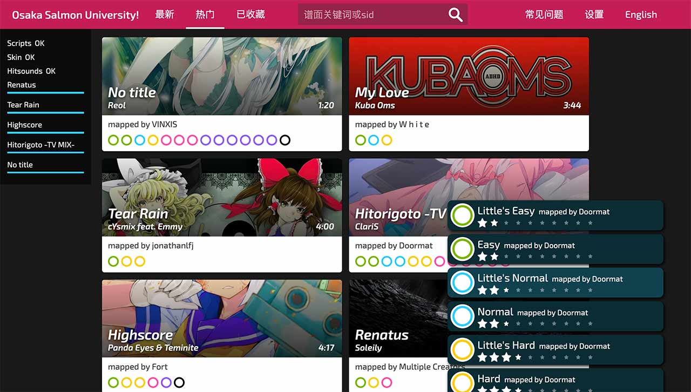

# osu! web

A browser rhythm game where you click circles on the screen, following rhythm of the music.

Powered by [PixiJS](https://www.pixijs.com), [Sayobot](https://osu.sayobot.cn).

**(under development)**

Note: This is an unofficial implementation of [osu!](https://osu.ppy.sh). Scoring and judgement rules can differ from that of official osu!. Some music might not be perfectly syncing (still being tested). Modes other than osu! (std) are unsupported.

## Screenshots

web page:



game in action:


## Hosting

Set up a web server with root directory located where `index.html` is in.

For live score display, redirect send/fetch api requests to localhost:3000/3001 respectively, and change the api url in `index.html` and `scripts/overlay/score.js` accordingly. Then run:

```bash
nohup node api.js &
```

## Todos

- audio offset
- input offset
- beatmap hitsounds
- supported mods: EZ DC HR NC HD AT

## License Notes

Some media files are copyrighted by [ppy](https://github.com/ppy/) and other people. Check their respective license before you use them.
